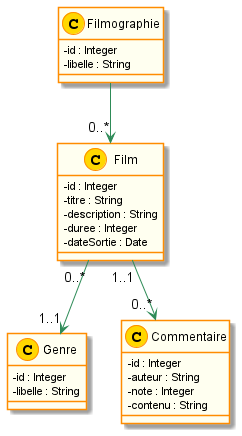

# Projet Filmographie

## Installer les dépendances
Après avoir cloné le projet, vous devez vous positionner dans le dossier du projet :
```
cd <nom-dossier>
```
Installez les dépendances de **composer**
 ```
composer install
 ```
Le projet utilise les dépendances suivantes :
* Faker
* var-dumper (de Symfony)

Le projet est configuré pour utiliser l'autoload au standard PSR-4.   
Le namespace de base pour les classes du projet est **App\\**

## Diagramme de classes
Voici le diagramme de classes du projet Filmographie

  

## Travail à réaliser
1/ Créer les classes à partir du diagramme de classes en PHP

Le fichier **filmographieTest.php** vous permettra de tester les différentes méthodes.  
Dans un premier temps, vous devrez créer votre jeu de test en utilisant la librairie **Faker**.   

### Fonctionnalité 1 (code : US1)
1/ Dans la classe **Filmographie**, créez une méthode **ajouterFilm(Film $film)** permettant d'ajouter un film à une filmographie.   
**On ne doit pas pouvoir ajouter 2 fois le même film à une filmographie.**   
2/ Dans la classe **Film**, créez une méthode **ajouterCommentaire(Commentaire $commentaire)** permettant d'ajouter un commentaire à un film.   

Vous devez créer une branche **us1** pour implémenter cette fonctionnalité. Lorsque vous êtes satisfait de votre travail, pensez à **merger** votre branche avec la branche **master**.

### Fonctionnalité 2 (code : US2)
Dans la classe **Filmographie**, créez une méthode **rechercheFilmsParGenre($genre)** permettant de retourner la liste des films dont le genre est égal à **$genre**.   

Vous devez créer une branche **us2** pour implémenter cette fonctionnalité. Lorsque vous êtes satisfait de votre travail, pensez à **merger** votre branche avec la branche **master**.    

### Fonctionnalité 3 (code : US3)
Dans la classe **Filmographie**, créez une méthode **rechercheFilmsMoyenneCommentairesSup($moyenne)** permettant de retourner la liste des films dont la moyenne des commentaires est supérieure ou égale à **$moyenne**.   

Vous devez créer une branche **us3** pour implémenter cette fonctionnalité. Lorsque vous êtes satisfait de votre travail, pensez à **merger** votre branche avec la branche **master**.
  
